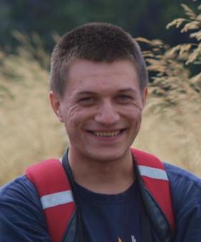
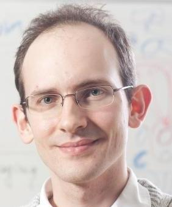
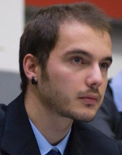
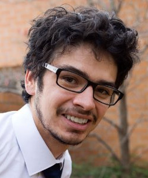
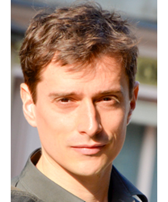
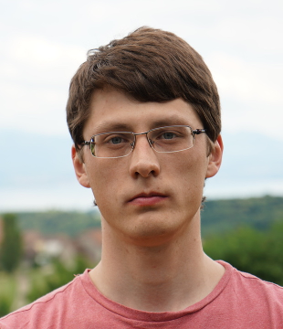

## Contributors

  

    
     
    <a href="http://people.epfl.ch/george.candea" target="_blank" class="external">George Candea</a>
  

  

    
     
    <a href="http://people.epfl.ch/alex.copot" target="_blank" class="external">Alexandru-Mihai Copot</a>
  

  

    
     
    <a href="https://www.linkedin.com/in/vitaly-chipounov-132b2459" target="_blank" class="external">Vitaly Chipounov</a>
  

  

    
     
    <a href="https://www.linkedin.com/in/aristidefattori" target="_blank" class="external">Aristide Fattori</a>
  

  

    
     
    <a href="https://www.linkedin.com/in/adrianherrera02/" target="_blank" class="external">Adrian Herrera</a>
  

  

    
     
    <a class="external">Paul Hordiienko</a>
  

  

  

    
     
    <a href="http://people.epfl.ch/cristian.zamfir" target="_blank" class="external">Cristian Zamfir</a>
  

  

    
     
    <a href="http://people.epfl.ch/petr.zankov" target="_blank" class="external">Petr Zankov</a>
  

  

    
     
    <a target="_blank" class="external">Bin Zhang</a>
  

<a href="https://www.linkedin.com/in/volodymyrkuznetsov">Volodymyr Kuznetsov</a> 
Co-author of the S2E engine

<a href="https://www.linkedin.com/in/radubanabic">Radu Banabic</a> 
Testing distributed systems

<a>Ana Sima</a> 
String solver integration

<a>Daniel Mahu</a> 
Cloud infrastructure, static analysis

<a href="http://www.stefanbucur.net/">Stefan Bucur</a> 
Core symbolic execution engine, constraint solving, parallel symbolic execution,
state merging, symbolic execution of interpreted languages

<a>Andy Roulin</a> 
Guest analysis tools, hardware virtualization

<a>Yoan Blanc</a> 
Cloud infrastructure

<a>Roger Michoud</a> 
Reliability testing

<a>Damien Engels</a> 
Toolchain integration

<a>Francesco Fucci</a> 
Fast dynamic binary interpreter

<a>João Carreira</a> 
Lightweight snapshotting

<a>Andreas Kirchner</a> 
First S2E ARM prototype

