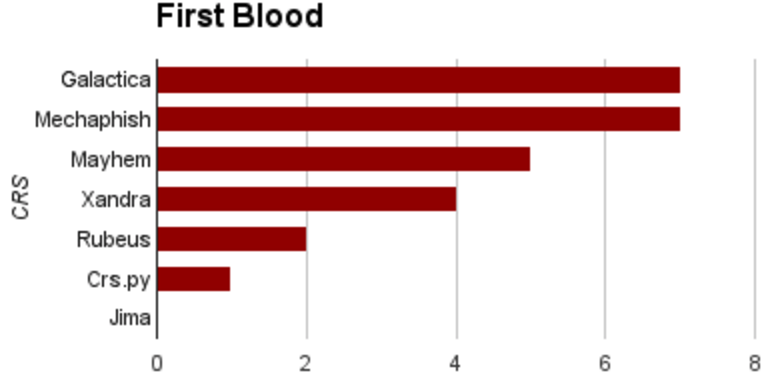
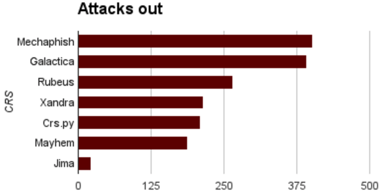
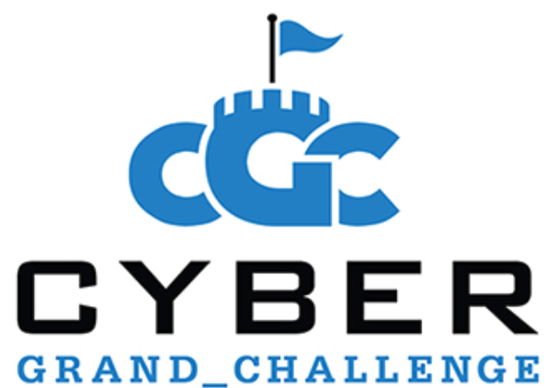
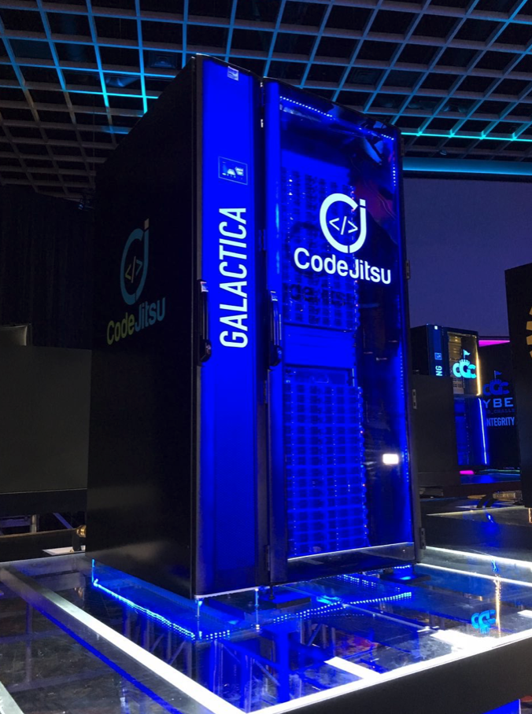
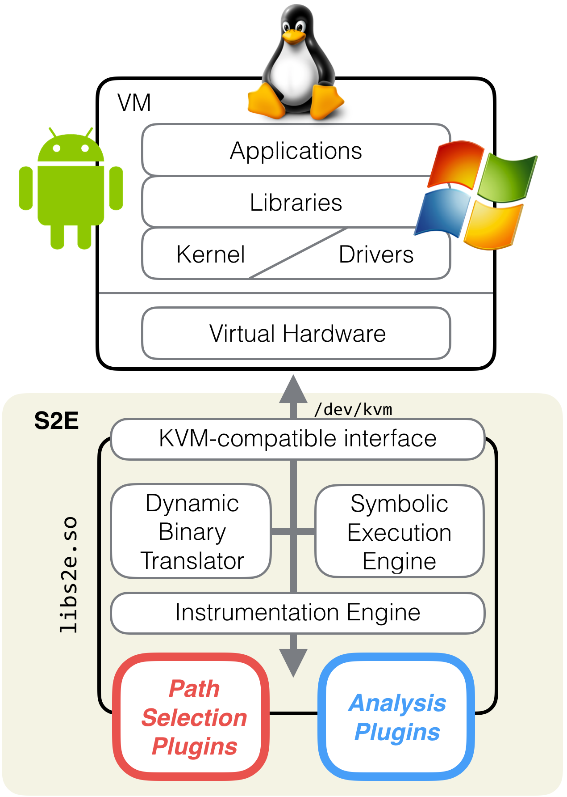
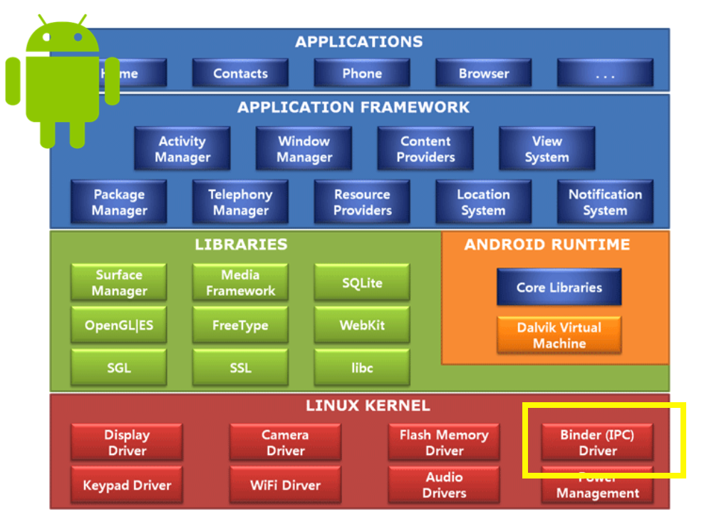

<h1>{{ site.name }}</h1>

S²E is a platform for writing tools that analyze the properties and behavior of software systems. Researchers have used
S²E to develop performance profilers, reverse engineering tools for proprietary software, vulnerability finding tools
for both kernel-mode and user-mode binaries, scalable file system checkers, symbolic execution engines for interpreted
languages, tools for finding trojan messages in distributed systems, verifying software routers, testing embedded
systems, and more.

S²E comes as a modular library that gives virtual machines symbolic execution and program analysis capabilities. S²E
runs unmodified x86, x86-64, or ARM software stacks, including programs, libraries, the kernel, and drivers. Symbolic
execution then automatically explores hundreds of thousands of paths through the system, while analyzers check that the
desired properties hold on these paths and selectors focus path exploration on components of interest.

  

    S²E is released under the MIT license and supported by the community.
    S²E was a research project of the Dependable Systems Lab at EPFL in Lausanne.
    For academic projects, please contact <a href="http://dslab.epfl.ch">DSLAB</a>.
  

    

        <h4>Finding security vulnerabilities in binaries</h4>
        

        Security researchers around the world use S²E to find critical vulnerabilities
        in all kinds of software. Here is a sample of some of the CVEs:
        

        

        <a href="https://www.cvedetails.com/cve/CVE-2017-15102/" target="cve">CVE-2017-15102</a>,
        <a href="https://www.cvedetails.com/cve/CVE-2016-5400/" target="cve">CVE-2016-5400</a>:
        several vulnerabilities in Linux USB drivers that caused denial of service and complete system compromise. 

        <a href="https://www.cvedetails.com/cve/CVE-2016-7219/" target="cve">CVE-2016-7219</a>: information disclosure in a
        cryptography driver that affected all versions of Windows from Vista to 10. 
        <a href="https://www.cvedetails.com/cve/CVE-2016-0040/" target="cve">CVE-2016-0040</a>,
        <a href="https://www.cvedetails.com/cve/CVE-2015-6098/" target="cve">CVE-2015-6098</a>: buffer overflows in kernel
        components leading to local privilege escalation on various versions of Windows. 

        <a href="http://www.cvedetails.com/cve/CVE-2015-1536/" target="cve">CVE-2015-1536</a>:
        improper (un)marshalling of bitmaps triggered through the Android clipboard,
        integer overflow, and null pointer dereferencing that can crash the system, no permissions needed.
        

    

  

    <h4 id="s2e-cgc">S²E competed in the finals of the <a target="cgc" href="https://www.cybergrandchallenge.com/">DARPA Cyber Grand Challenge</a></h4>
    <ul>
      <li>The Cyber Grand Challenge is a competition where opponents are computers whose goal is to automatically find, exploit, and defend running services against
      vulnerabilities.</li>
      <li>Cyberhaven built the Galactica system as part of the CodeJitsu team, together with UC Berkeley and Syracuse University</li>
      <li>2 teams out of 7 used S²E during the finals</li>
      <li>First blood: S²E exploited 7 binaries before everyone else!</li>
      <li>S²E launched 392 successful attacks, twice as much as Mayhem and Xandra</li>
    </ul>
    

    Want to run S²E on CGC binaries? Check out the <a href="docs">tutorials</a>! <!-- and the blog posts! -->
    

    

      

          
      

      

          
      

        <!--

-->
    

  

  

    
  

  

    
  

  

    <h4>S²E is powerful</h4>
    <ul>
      <li>It works at any level of the stack: applications, libraries, kernel drivers, and device firmware.</li>
      <li>It generates test cases to prove the existence of vulnerabilities, without false positives.</li>
      <li>It has advanced support for Windows and Linux targets with built-in support for execution tracing, code coverage,
      and profiling.</li>
      <li>It automatically runs entire software stacks on hundreds of thousands of paths to find corner case vulnerabilities
      out of reach of traditional testing tools.</li>
    </ul>
  

  

    <h4>S²E is modular and flexible</h4>
    <ul>
      <li>You can run your existing analysis tools such as fuzzers or sanitizers on top of S²E to get the power of
      multi-path analysis for free.</li>
      <li>Even if you don't need symbolic execution, you can still use S²E as a powerful single-path
      instrumentation platform.</li>
      <li>Do you want to use S²E but don’t want the overhead of a VM? S²E emulates the KVM interface, which makes it easy
      to integrate into custom binary analysis projects.</li>
    </ul>
  

  

    <h4>S²E supports state-of-the-art program analysis techniques</h4>
    <ul>
    <li>Efficient navigation through large state spaces with concolic and symbolic execution, state merging,
    static analysis, function summaries, incremental constraint solving.</li>
    <li>Security checking, testing, verification, reverse engineering, performance profiling, etc.</li>
    <li>Quickly prototype your research ideas by combining existing plugins or writing your own.</li>
    <li>Used by hundreds of researchers around the world.</li>
    </ul>
  

<!--

  

    
  

  

    <h4>S²E discovered <a href="http://www.cvedetails.com/cve/CVE-2015-1536/?q=CVE-2015-1536" target="cve">CVE-2015-1536</a>
    in Android 5.0.2</h4>
    <ul>
      <li>Found 3 unknown bugs in < 5 minutes</li>
      <li>Improper (un)marshalling of bitmaps triggered through the clipboard</li>
    </ul>

    <ul>
      <li>
        Integer overflow and NULL pointer dereferencing
        <ul>
          <li>No permissions needed</li>
          <li>Can read uninitialized memory</li>
          <li>Can crash the system (soft reboot)</li>
        </ul>
      </li>
      <li>2 x NULL pointer dereferencing that can crash the system</li>
    </ul>
  

-->

  

    <h4>Live Demo</h4>
    

    This demo shows S2E finding vulnerabilities in the <a href="https://github.com/CyberGrandChallenge/samples/tree/master/examples/CADET_00001">CADET_00001</a> binary
    from the Cyber Grand Challenge. Run the command below in order to try it
    out on your machine. There is no need to do anything besides typing this
    command. Downloading and setting up the docker image should take 5-10 minutes depending on
    your network connection and take around 10GB of disk space.
    

    <pre>
$ docker run --rm -ti -w $(pwd) -v $HOME:$HOME cyberhaven/s2e-demo \
  /demo/run.sh $(id -u) $(id -g) /demo/CADET_00001</pre>

  

  You will see a dashboard showing how many test cases S2E found.
  These test cases demonstrate a program crash or the presence of an actual vulnerability,
  for which S2E found program inputs that allow an attacker to control the program's memory and/or register contents (i.e., a proof of vulnerability, or PoV).
  After a while, stop the analysis. The analysis output is stored on your host machine and
  you will find the test cases in <tt>$(pwd)/s2e-demo/projects/CADET_00001/s2e-last/{*.c|*.xml}</tt>
  files. Their format follows the CGC <a href="https://github.com/CyberGrandChallenge/cgc-release-documentation">specification</a> and they can be run in a CGC VM.
  

    

    
    

  

<!--
S²E's novelty consists of its ability to scale to large real
systems, such as a full Windows stack. S²E is based on two new ideas:

  *  Selective symbolic execution, a way to automatically minimize the amount of code that has to be executed symbolically given a target analysis; and
  *  Relaxed execution consistency models, a way to make principled performance/accuracy trade-offs in complex analyses.

These techniques give S²E three key abilities:

  *  to simultaneously analyze entire families of execution paths, instead of just one execution at a time;
  *  to perform the analyses in-vivo within a real software stack—user programs, libraries, kernel, drivers, etc.—instead of using abstract models of these layers; and
  *  to operate directly on binaries, thus being able to analyze even proprietary software.

Conceptually, S²E is an automated path explorer with modular path
analyzers: the explorer drives the target system down all execution
paths of interest, while analyzers check properties of each such
path (e.g., to look for bugs) or simply collect information (e.g.,
count page faults). Desired paths can be specified in multiple ways,
and S²E users can either combine existing analyzers to build a
custom analysis tool, or write new analyzers using the S²E API.

S²E helps make analyses based on symbolic execution practical for
large software that runs in real environments, without requiring
explicit modeling of these environments.

-->
